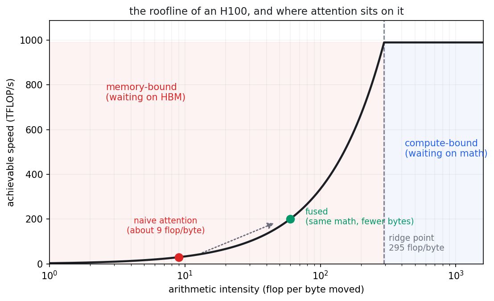
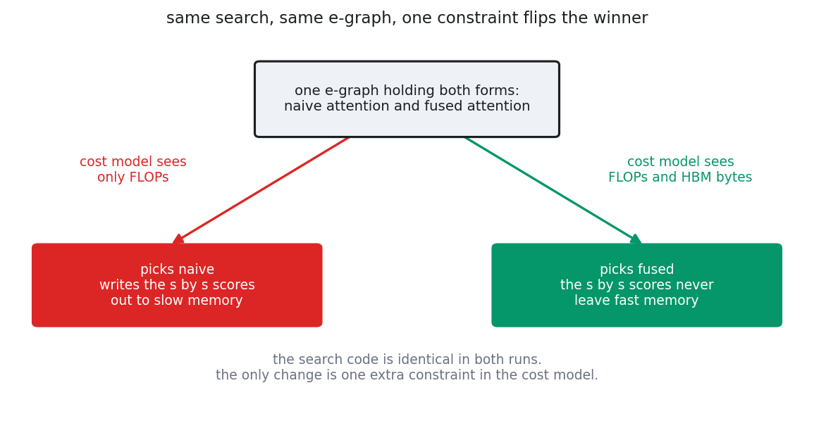
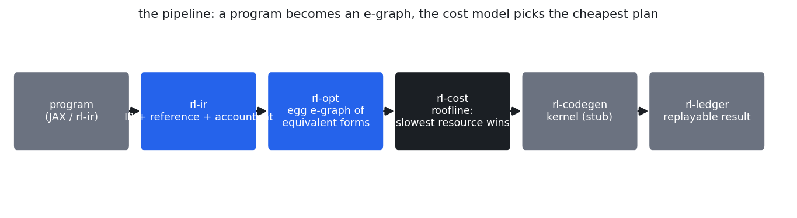
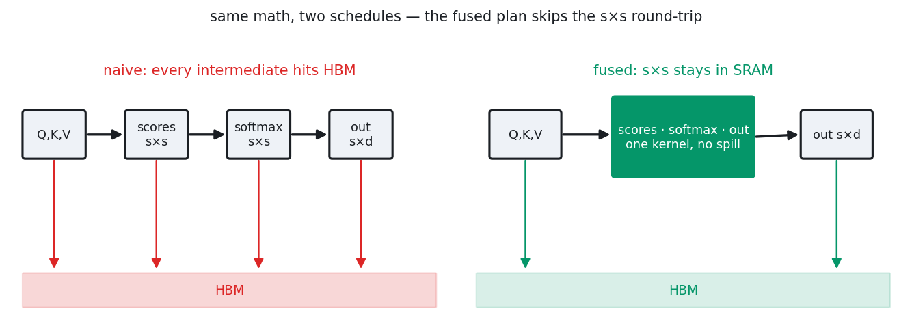

# roofline

A compiler that picks the fastest way to run neural network math, the same way
a database picks the fastest way to run a query.

You give it a small tensor program, say attention or an MLP layer. It builds
every mathematically equal way of computing the same answer, asks a cost model
which one the hardware would actually run fastest, and picks that one. The
interesting part is not the search. The interesting part is that the cost
model is built from physical limits of the machine, and when the picker gets
something wrong, the fix is always to teach the cost model about one more
physical limit. Never to hack the search.

Companion files: `DESIGN.md` is the formal spec, `WORKFLOW.md` is how the work
is done across sessions, `CLAUDE.md` is the short operating guide a coding
session loads first. This README is the long version, written so that someone
with no background in GPUs or compilers can follow the whole thing. It gets
updated every milestone.

---

## contents

1. [the story this project starts from](#1-the-story-this-project-starts-from)
2. [the two speeds inside a GPU](#2-the-two-speeds-inside-a-gpu)
3. [the database idea](#3-the-database-idea)
4. [the one rule everything follows](#4-the-one-rule-everything-follows)
5. [the headline result, the A/B flip](#5-the-headline-result-the-ab-flip)
6. [how the code is laid out](#6-how-the-code-is-laid-out)
7. [rl-ir, the language and the referee](#7-rl-ir-the-language-and-the-referee)
8. [rl-cost, the cost model](#8-rl-cost-the-cost-model)
9. [rl-opt, the e-graph and the extractor](#9-rl-opt-the-e-graph-and-the-extractor)
10. [fusion, the trick the optimizer has to find](#10-fusion-the-trick-the-optimizer-has-to-find)
11. [rl-codegen, the kernel that proves it](#11-rl-codegen-the-kernel-that-proves-it)
12. [the milestones and their numbers](#12-the-milestones-and-their-numbers)
13. [how the work stays honest](#13-how-the-work-stays-honest)
14. [what this is not](#14-what-this-is-not)
15. [build, test, run, resume](#15-build-test-run-resume)
16. [small glossary](#16-small-glossary)
17. [what comes next](#17-what-comes-next)

---

## 1. the story this project starts from

In 2022 a group at Stanford published Flash Attention. It computes exactly the
same attention function every transformer already used, the same inputs, the
same outputs, down to floating point noise. It even does slightly more
arithmetic than the standard version. And it runs several times faster.

How can the same math, with more arithmetic, be faster? Because the slow part
was never the arithmetic. The standard way of computing attention builds a
large intermediate table, the score matrix, writes it out to the GPU's main
memory, reads it back, writes another table, reads that back too. For a
sequence of 2048 tokens that table is 2048 by 2048 numbers, 16 MB, and the
naive plan drags it back and forth several times. Flash Attention organizes
the work so the table never gets written out at all. It lives briefly in the
GPU's small fast memory, gets used, and is gone. Fewer bytes moved, much
faster, same answer.

A person had to notice that. Tri Dao and his coauthors understood the hardware
deeply enough to see that the memory traffic, not the math, was the bill, and
they redesigned the schedule around it.

The bet of this project: a machine could have found that. Not by being clever,
but by being told the actual physical constraint, that moving bytes costs
time, and then searching the space of equal programs for the one with the
smallest bill. The whole repo is that bet, built small enough for one person
to finish: a tiny tensor language, a search over equivalent forms, a cost
model made of physical limits, and a benchmark at the end of every milestone
so the claims are numbers, not vibes.

---

## 2. the two speeds inside a GPU

To follow anything else in this README you only need one mental picture.

A GPU has compute units that do arithmetic, and they are absurdly fast. An
H100 can do about 989 trillion floating point operations per second. Call each
of those operations a flop.

A GPU also has memory, and here is the catch, it has two kinds. There is a big
slow memory called HBM, tens of gigabytes, where your model weights and
activations live. And there is a tiny fast memory called SRAM, a few dozen
megabytes, right next to the compute units. Data has to be in SRAM to be
computed on. The pipe between HBM and SRAM moves about 3.35 terabytes per
second on an H100, which sounds like a lot until you divide: the chip can do
roughly 295 flops in the time it takes to move a single byte.

So every program has a budget question. How many flops does it do per byte it
moves? That ratio is called arithmetic intensity. If your program does fewer
than about 295 flops per byte, the compute units finish early and sit there
waiting for memory. You are memory-bound. More than that, and memory keeps up
while the compute units become the limit. You are compute-bound. Plot it and
you get a line that rises and then goes flat, shaped like a roofline.



*the roofline of an H100. naive attention does about 9 flops per byte moved,
far left, deep in the memory-bound zone. fusion does not reduce the math, it
reduces the bytes, which slides the point right along the curve.*

Naive attention sits at about 9 flops per byte. Nine, against a ridge of 295.
It spends almost all of its time waiting on memory. That is why removing
memory traffic, which is all Flash Attention does, is worth several times the
speed, and why counting flops alone tells you almost nothing about how fast a
tensor program will run.

---

## 3. the database idea

Databases solved this exact shape of problem fifty years ago.

A SQL query can be executed in many different orders: which table to scan
first, which join algorithm to use, which index to consult. All of them return
the same rows. Their costs differ by factors of thousands. So every serious
database has a query optimizer: it enumerates equivalent plans, scores each
one with a cost model built from physical quantities like disk reads and
memory, and runs the cheapest.

Now swap the words. A tensor program can be computed in many different orders:
which matmul to group first, whether to keep an intermediate or recompute it,
whether to write a table out or consume it on the spot. All of them return the
same numbers. Their costs differ by large factors, and the dominant physical
quantity is bytes moved between HBM and SRAM instead of disk reads.

Same machinery, different cost model. That reuse is the entire design. This
repo is a query optimizer pointed at tensor programs, and several pieces of it
are studied directly from database codebases (`risinglight` for the
optimizer pattern, `toydb` for the write-ahead log that records results).

---

## 4. the one rule everything follows

Everything in the repo serves one design decision:

> The cost model is a set of pluggable physical constraints, and a plan's
> predicted time is whichever constraint is slowest.

A constraint is one resource with a hard physical limit. Compute is one: a
plan that needs N flops cannot finish faster than N divided by the chip's peak
flops. Memory bandwidth is another: a plan that moves B bytes cannot finish
faster than B divided by the bandwidth. Each constraint gives a lower bound on
time, the real time is at least the largest of them, and the constraint that
produces that largest bound is called the binding resource. The model does not
just say "1.6 milliseconds", it says "1.6 milliseconds, and memory is the
reason".

This forces the discipline the project is really about:

> When the optimizer picks a bad plan, the cause is always a missing
> constraint in the cost model, never a broken search.

If the picker chooses something slow, you do not patch the search with a
special case. You ask which physical limit it could not see, write that limit
as a new constraint, usually about twenty lines, and the picker corrects
itself. The failure is named and localized by construction. That is what keeps
the system from rotting into a pile of heuristics.

---

## 5. the headline result, the A/B flip

The result the repo exists for is one controlled experiment, and it now runs
as a passing test.

Build one e-graph (explained in section 9, for now: one structure holding many
equal programs) that contains both naive attention and the fused, Flash-like
form. Ask for the cheapest plan twice. The only difference between the two
runs is what the cost model can see.



*the whole thesis in one picture. when the cost model can only see flops it
keeps naive attention, because fusion saves no flops. add the memory
constraint and the winner flips to the fused form. nothing about the search
changed.*

With only the flops constraint, the model literally cannot see memory traffic.
Fusion saves zero flops, so the model has no reason to prefer it, and it keeps
the naive plan. This is the local optimum a flops-only mindset gets stuck in.

Add the HBM bytes constraint and the model now sees that the naive plan drags
a 16 MB table through slow memory several times while the fused plan does not.
The winner flips. Same e-graph, same search code, one extra constraint.

```rust
let candidates = [naive, fused];                 // both reachable in one e-graph
let flops_only = CostModel::new().add(FlopsConstraint::new(H100));
let with_hbm   = flops_only.clone().add(HbmConstraint::new(H100));

assert_eq!(select_plan(&candidates, &shapes, &flops_only), 0); // keeps naive
assert_eq!(select_plan(&candidates, &shapes, &with_hbm),    1); // picks fused
```

Two details keep this honest. First, the fused form is not hand-delivered to
the picker: a test called `fused_form_is_reachable_by_rewrite` proves a
general rewrite rule places it in the e-graph during the search, in the same
equivalence class as the naive program. Second, the flip also happens at the
extractor level, where the picker walks the whole e-graph rather than ranking
two named candidates; that is the `extractor_flips_with_hbm_constraint` test.
As of milestone 5 the same pair of tests exists for the MLP, so the flip is a
property of the system, not a one-off about attention.

---

## 6. how the code is laid out

A Rust workspace with five crates, one job each. The arrow of dependency only
points left: the cost model and the optimizer depend on the language, nothing
depends on codegen or the ledger.



*a program enters as a term in the tiny tensor language, the optimizer grows
the e-graph of equal forms, the cost model picks the cheapest, codegen lowers
the winner to a runnable kernel, and the ledger records the measured result so
it can be replayed.*

| crate | job | status |
|---|---|---|
| `rl-ir` | the tensor language, the reference interpreter that defines correct, and the accountant that counts true flops and bytes | working |
| `rl-cost` | devices, the constraint trait, the slowest-resource cost model | working |
| `rl-opt` | rewrite rules, the e-graph, shape analysis, cost-driven extraction | working |
| `rl-codegen` | turns the chosen plan into an executable kernel | working, CPU kernels (attention and MLP) |
| `rl-ledger` | write-ahead log of preregistered benchmark results, replay | working |
| `roofline-cli` | the `roofline` command gluing the ledger to the bench runners | working |

Why Rust for all of it: the hot paths need to be fast, the type system catches
a lot of nonsense early, and `toydb` proves a complete distributed database
fits in about 15 thousand lines of Rust, so a one-person optimizer core is a
reasonable bet. A JAX front end and real GPU kernel output (Pallas or Triton)
are planned for when an accelerator is available.

One naming rule applies everywhere, in code and prose: every tensor name
carries its shape. `Q_sd` is the query matrix, sequence by dimension.
`scores_ss` is sequence by sequence. If the shape is not in the name, the name
is wrong. It sounds fussy and it pays for itself daily, because every cost
argument in this project is an argument about shapes.

---

## 7. rl-ir, the language and the referee

This crate was built first and everything else stands on it. It answers three
questions: what is a program, what does correct mean, and what does a program
truly cost.

A program is a term in a deliberately tiny language, seven node types:

```rust
define_language! {
    pub enum TensorLang {
        Var(Symbol),                     // a named input, e.g. Q_sd
        "matmul"    = MatMul([Id; 2]),   // [m,k] x [k,n] -> [m,n]
        "transpose" = Transpose([Id; 1]),// [m,n] -> [n,m]
        "emul"      = EMul([Id; 2]),     // elementwise multiply, scalars broadcast
        "softmax"   = Softmax([Id; 1]),  // stable softmax over the last axis
        "relu"      = Relu([Id; 1]),     // max(x, 0), the MLP's nonlinearity
        "fuse"      = Fuse([Id; 1]),     // run the subtree as one kernel
    }
}
```

That is enough to write the two programs the project cares about. Attention is
`softmax((Q_sd x K_sd transposed) x scale) x V_sd`. The MLP is
`relu(X_sd x W_up_df) x W_dn_fd`, the up projection into a hidden width f,
a relu, and the down projection back to width d. The relu is not decoration.
Without it the two matmuls are one linear map and the mathematically right
move is to collapse them into a single small matrix, which the optimizer's own
associativity rule would happily do. The relu blocks the collapse, exactly as
it does in a real network, and leaves fusion as the interesting option.

Correct is defined by the reference interpreter. It evaluates a term with the
most obvious code possible, triple-loop matmuls, a textbook stable softmax,
nothing fast about it. Its job is to be so plainly right that it can serve as
the referee: any kernel this project ever produces must match it to within
1e-5, or the kernel's speed does not count. A fast wrong kernel is worth
nothing.

Cost is measured by the accountant. It walks a program and counts, under an
explicit and deliberately pessimistic model, the flops and the bytes that
would move if every intermediate were written to HBM. A matmul of [m,k] by
[k,n] is `2 m k n` flops and writes `m n` numbers at four bytes each. A relu
or emul touches each element once. Inputs are read once. This "everything is
materialized" model is the baseline the project exists to beat, and its
inaccuracy against real hardware is not hidden, it is milestone 1's
calibration work and it is recorded as deferred until a real accelerator is
available.

Divide the two counts and you get flops per byte, which places a program on
the roofline plot from section 2. For naive attention the accountant reports
about 9 to 11 regardless of sequence length. That number is the whole story of
why attention is memory-bound.

---

## 8. rl-cost, the cost model

The smallest crate, on purpose, because it is the idea itself.

A device is its peak numbers:

```rust
pub const A100: Device = Device::new("A100-80GB", 312e12, 2.0e12);
pub const H100: Device = Device::new("H100-SXM", 989e12, 3.35e12);
```

A constraint turns a program's demands into a floor on time:

```rust
pub trait Constraint {
    fn name(&self) -> &str;
    fn lower_bound_s(&self, flops: u64, hbm_bytes: u64) -> f64;
}
```

`FlopsConstraint` returns flops divided by peak flops. `HbmConstraint` returns
bytes divided by bandwidth. The cost model holds a list of constraints,
evaluates all of them, and returns the largest time along with the name of the
constraint that produced it, the binding resource. That name is the diagnostic
payoff: run `cargo run -p rl-cost --example m1_binding` and it prints
`binding=HbmBytes` for attention across a sweep of shapes, which is the
machine telling you what Tri Dao knew.

Adding a constraint never touches the existing ones. SRAM capacity, occupancy,
communication for multi-chip, each is a new twenty-line struct and a field on
the device. That is what makes "the model was missing a constraint" a small
fix instead of a redesign.

---

## 9. rl-opt, the e-graph and the extractor

This is the crate where equal programs are generated and the cheapest one is
chosen, and it is the densest part, so here is the idea from scratch.

Suppose you know that `(A x B) x C` equals `A x (B x C)`. If you rewrite a
program by replacing one with the other, you have destroyed the original, and
maybe the original was better. You want to keep both and decide later. Apply
that across many rules and many subterms and the number of variants explodes.

An e-graph stores them all compactly. It groups expressions into equivalence
classes, e-classes, where everything in a class is proven equal to everything
else, and a node points to child classes rather than child expressions, so one
small structure represents an enormous set of concrete programs. Saturation
means applying every rewrite rule until nothing new appears. After saturation
the e-graph holds every program your rules can reach.

The rules are plain algebra, each one a mathematical identity:

```rust
// regrouping a matmul chain changes the work, not the answer
"(matmul (matmul ?a ?b) ?c)"  <=>  "(matmul ?a (matmul ?b ?c))"

// a transpose can move through a matmul
"(transpose (matmul ?a ?b))"  =>   "(matmul (transpose ?b) (transpose ?a))"

// a scalar scale can be applied before or after a matmul
"(matmul (emul ?a ?s) ?b)"    <=>  "(emul (matmul ?a ?b) ?s)"

// a producer consumed immediately by a matmul can run as one kernel
"(matmul (softmax ?x) ?v)"    =>   "(fuse (matmul (softmax ?x) ?v))"
"(matmul (relu ?x) ?v)"       =>   "(fuse (matmul (relu ?x) ?v))"
```

The scale rule is a nice concrete case: in attention the 1 over sqrt(d) factor
can multiply the small Q matrix before the big matmul or the large score
matrix after it. Same answer, different bytes. The e-graph keeps both and the
cost model decides.

A hard project rule, rule 4 in `CLAUDE.md`: there is no rewrite that says
"attention becomes Flash Attention". The fused forms must be reachable by
composing small general identities, like the two fusion rules above, which
know nothing about attention or MLPs. Hard-coding the destination would mean
the optimizer discovered nothing.

To cost plans the e-graph needs shapes, so a shape analysis rides along during
saturation and gives every e-class its [rows, cols]. And then comes
extraction, picking one concrete program out of the saturated e-graph, which
has a famous trap. The default extractor in the `egg` library scores trees,
which counts a shared input once per use. Attention uses Q, K, V all over the
place, so tree scoring double-counts them badly; the Tensat project hit
exactly this wall. The exact fix is integer linear programming
(`egg::LpExtractor`), but its solver is a C library that does not build on
this machine, so the repo uses a custom extractor instead: a greedy bottom-up
pass driven by the real cost model, with a cycle guard, that prices each
e-class from its true shape, and then a second stage that asks whether
wrapping the winning plan in `fuse` makes it cheaper under the active
constraints. Stage two is where the A/B flip physically happens. Greedy is not
guaranteed optimal and the README says so plainly; exact extraction is listed
as future polish, not assumed.

---

## 10. fusion, the trick the optimizer has to find

Fusion deserves its own picture because it is the thing the whole experiment
turns on.

The naive attention plan computes the score matrix, writes all 16 MB of it to
HBM, reads it back to scale it, writes the result, reads that back for
softmax, writes the probabilities, reads them again for the final matmul. The
math is four steps, the memory bill is the same giant table moved over and
over.



*same math, two schedules. on the left every stage writes its result down to
slow memory and the next stage reads it back. on the right the whole chain
runs as one kernel, the big tensors live and die in fast memory, and only the
inputs and the final output ever touch HBM.*

In the language this is the `fuse` node. Wrapping a subtree in `fuse` changes
nothing about the value, the interpreter just evaluates the inside, so the
1e-5 correctness gate still applies. What changes is the accounting: a fused
region is charged HBM only for its distinct inputs and its final output, never
for what happens in between. The same node fuses the MLP, where the tensor
that never spills is the s by f hidden activation matrix instead of the s by s
scores. Two tests pin the contract for each program: fused output equals naive
output to 1e-5, and fused bytes are smaller by at least one full tile of the
big intermediate while flops stay exactly equal.

The caveat, stated loudly because it is the next piece of real work: treating
the whole fused region as free of memory traffic assumes the working set fits
in SRAM. Real Flash Attention tiles precisely because it does not fit. The
missing piece is an SRAM capacity constraint that forces tiling at large
sizes, and the satisfying part is that this gap is itself an instance of the
project's one rule. The model is missing a constraint. The fix is twenty
lines in `rl-cost`, not a rewrite of anything.

---

## 11. rl-codegen, the kernel that proves it

Until milestone 4 the fused plan was an accounting claim. This crate makes it
an executable one.

`lower()` looks at the plan the optimizer chose. A plan with a `fuse` node
whose chain contains a softmax lowers to the fused attention kernel; a fused
chain with a relu lowers to the fused MLP kernel; anything else falls back to
the reference interpreter. The optimizer's decision is what selects the fast
path, there is no flag anywhere saying "use the fast kernel".

The fused attention kernel is the online softmax, the same idea at the heart
of Flash Attention: walk the keys one at a time keeping a running maximum, a
running sum, and a running weighted output, so the s by s score matrix never
exists anywhere. The fused MLP kernel streams one token row at a time, computes
its hidden activations into a buffer the size of one row, applies the relu,
multiplies by the down projection, and moves on, so the s by f hidden matrix
never exists either. Both kernels do the arithmetic in the same order as the
reference interpreter on purpose, no extra tricks, so the comparison measures
fusion and nothing else.

The gates, in order. First numerics: the kernels must match the reference
interpreter to 1e-5 across a sweep of shapes, enforced by unit tests, before
any speed number counts. Then wall clock. On this machine (CPU, since there is
no accelerator here) the fused attention kernel at d=64 measured 1.28 times
naive at s=1024, 1.57 times at s=2048, 1.21 times at s=4096, with errors
3.0e-6, 5.8e-6, 1.5e-5. Run it yourself:

```bash
cargo run -p rl-codegen --release --example m4_bench
```

The honest wrinkle in those numbers: at s=4096 the error, 1.5e-5, is over the
gate. That was investigated rather than waved away, and the cause is the f32
reference interpreter's own accumulation error at that size, not a kernel bug.
Giving the fused kernel f64 accumulators did not shrink the gap, which is what
shows the reference is the limiting side. The gate holds through s=2048, the
tested sweep stays in that range, and the wrinkle is recorded here and in the
milestone notes instead of being deleted. GPU kernel emission (Pallas or
Triton) is deferred until there is hardware to run it on.

---

## 12. the milestones and their numbers

The iron rule: a milestone ends in a benchmark number, not a refactor. Nothing
is done until its numeric criterion is met and written down.

| milestone | what it proves | the number | status |
|---|---|---|---|
| M0 | the language, interpreter, and accountant are trustworthy | matches a NumPy fixture, max error 2.98e-8 | done |
| M1 | the cost model names the binding resource | `binding=HbmBytes` for attention across the sweep | done, wall-clock calibration deferred until real hardware |
| M2 | the rewrites generate genuinely different forms | saturated e-graph provably contains them | done |
| M3 | the A/B flip | flops-only extracts naive, adding HBM extracts fused, same e-graph | done, `the_ab_flip` and `extractor_flips_with_hbm_constraint` pass |
| M4 | the chosen plan runs and wins for real | matches reference under 1e-5 through s=2048, 1.57x naive at s=2048 | done on CPU, GPU deferred |
| M5 | the same machinery wins on a second program, and results replay | preregistered 1.245x for the fused MLP at f = 8d, both headline claims hold again under `roofline replay` | done on CPU, A100 deferred |

How M5 actually went, in the order the rules demand. A pilot sweep (seed 42)
showed the fused MLP beating naive at every shape, 1.25x to 1.57x at s=2048
d=128, so the claim was preregistered with a fresh seed, 43, before the
measurement that counts: run `mlp-s43-001`, fused MLP at s=2048, d=128,
f=1024, success defined as speedup at least 1.10 with error under 1e-5. The
recorded result is 1.245x with error exactly zero (the kernel does the same
arithmetic in the same order as the reference, so the answers are
bit-identical). The attention headline was preregistered the same way as
`attention-s43-002` and recorded 1.209x. Then both were replayed from their
committed configs: 1.279x and 1.118x, claims hold, errors reproduce exactly.
The full history is plain JSON in `ledger/wal.jsonl`, and the assess script
now reads it, so a headline claim failing on some future change blocks the
push automatically.

The accountant's view of the same run says why fusion wins: the naive MLP
plan moves 19.9 MB through HBM at that shape, the fused plan 3.1 MB, a 6x
cut. On this CPU, where compute is the binding resource, that buys a modest
1.25x. On a bandwidth-starved accelerator the same byte cut is the whole
game, which is exactly what the cost model predicts and exactly what cannot
be measured here yet. The original M5 target, beating `jax.lax.ragged_dot`
on an A100, needs the A100, so like M1 and M4 the criterion was run honestly
on CPU and the GPU half is recorded as deferred rather than faked. 31 tests
across the workspace, all green.

---

## 13. how the work stays honest

This project is built across many separate coding sessions, which creates
three standing risks: losing state between sessions, grading your own work
generously, and claiming things that were never measured. The defenses are
mechanical, not aspirational, and live in `WORKFLOW.md`.

A scoring script, `scripts/assess.py`, computes a 0 to 100 score from machine
signals only. A failed build or failed test is an automatic zero. A headline
number moving the wrong way is a regression and blocks the push. The script
also greps for violations of the project's hard rules, like a hard-coded
naive-to-flash rewrite. The agent doing the work never assigns its own score.

Benchmarks are preregistered. Before a benchmark that produces a claim is run,
the configuration, the metric, and the success threshold get committed to the
ledger. The result is compared against what was preregistered, which closes
the door on quietly moving the goalposts after seeing the data.

And every stopping point writes a checkpoint file stating what is done, what
is half done, what is verified against what is merely believed, and the exact
next actions, so the next session resumes instead of re-deriving.

---

## 14. what this is not

Prior art exists and the README will not pretend otherwise. Tensat and SPORES
used e-graphs for tensor and linear algebra optimization before this. XLA,
TVM, tinygrad, and Mojo all do cost-based kernel scheduling in production.
The analogy to databases also strains in one place: SQL optimization is
dominated by guessing how many rows survive each filter, which is statistical
and data-dependent, while tensor shapes are known exactly, so the hard part
moves from estimating data to modeling the device. That shift is the point of
the project rather than a flaw in it.

What is genuinely this project's own: the discipline that every optimizer
failure must decompose into a missing physical constraint, made structural by
keeping the cost model a separate pluggable crate; and the insistence that the
fused forms be reached by general algebra and selected by cost, never
pattern-matched in.

Current real limitations, all tracked, none hidden: no GPU numbers anywhere
yet, the extractor is greedy rather than exact, the fuse model ignores SRAM
capacity, and the cost model's wall-clock predictions are uncalibrated until
there is an accelerator to calibrate against.

---

## 15. build, test, run, resume

```bash
# Rust toolchain lives at C:\Users\bhansa01\.cargo\bin (gnu, on the User PATH).
cargo build --workspace
cargo test  --workspace                        # numerics gates + unit tests

cargo run -p rl-ir   --example m0_numbers      # true flops and bytes per shape
cargo run -p rl-cost --example m1_binding      # which resource binds, per shape
cargo run -p rl-codegen --release --example m4_bench   # attention, naive vs fused
cargo run -p rl-codegen --release --example m5_bench   # MLP sweep across f/d

cargo run -p roofline-cli --release -- list              # what the ledger holds
cargo run -p roofline-cli --release -- replay mlp-s43-001        # re-prove M5
cargo run -p roofline-cli --release -- replay attention-s43-002  # re-prove M4

python scripts/assess.py                       # the objective score, gates pushes
python scripts/figures.py                      # regenerate the README figures
```

To resume work in a fresh session:

1. read `CLAUDE.md`, then this README
2. read the newest file in `quality_reports/checkpoints/`
3. run `python scripts/assess.py --start`, then `cargo test --workspace`
4. do the first action listed in that checkpoint

---

## 16. small glossary

- tensor: a rectangular array of numbers. A matrix is a 2-D tensor.
- flop: one floating point operation. A measure of arithmetic, not of time.
- HBM: the GPU's big slow memory.
- SRAM: the GPU's tiny fast memory, where compute actually happens.
- arithmetic intensity: flops per byte moved. Where a program sits on the
  roofline.
- ridge point: peak flops divided by peak bandwidth. Below it you wait on
  memory, above it you wait on math.
- binding resource: the constraint producing the slowest lower bound, the
  thing actually limiting the program.
- e-graph: a structure holding many programs proven equal, grouped into
  e-classes.
- saturation: applying rewrite rules until nothing new appears.
- extraction: choosing the single cheapest program out of a saturated e-graph.
- fusion: running a chain of operations as one kernel so the stuff in the
  middle never touches slow memory.
- preregistration: committing the benchmark config and success threshold
  before running it.

---

## 17. what comes next

All six milestones are done in their CPU-honest form, so what remains is the
deferred and the next layer. In rough order: an SRAM capacity constraint that
forces tiling at sizes where the fused region cannot fit, which is the
project's own rule applied to its own known gap; real GPU kernel emission
(Pallas or Triton) once hardware is available, plus the A100 runs that M1, M4,
and M5 each have on hold; calibration of predicted against measured time on
that hardware; exact ILP extraction when a solver is available; and further
out, a rewrite proposer that suggests new algebraic identities and only admits
them after they pass the same numerics and benchmark gates as everything else.

This file grows with the project. When a milestone lands, its row in the table
gets the number that earned it.
