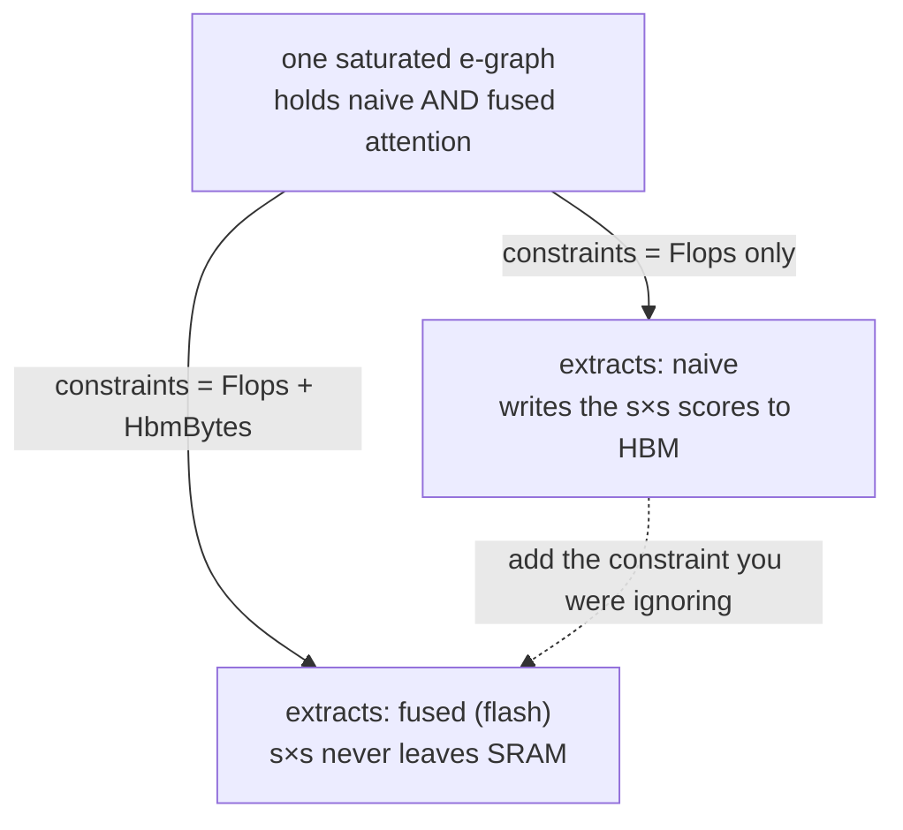
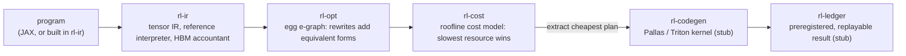
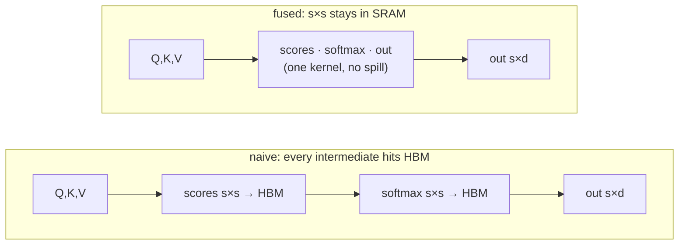

# Roofline

A cost-based optimizing compiler for tensor programs, built like a query engine.

Roofline takes a neural-network computation, represents every equivalent way of
running it in one structure, scores each by the physical resource that would
actually bottleneck it, and picks the cheapest. The same machine a database uses
to optimize a SQL query, pointed at a tensor program.

This README explains what the project is and how it works. Two companion files
carry the rest: `DESIGN.md` is the full technical spec, and `WORKFLOW.md` is the
development process (assessment loop, context rules, how to resume a session).
`CLAUDE.md` is the short operating guide loaded each session.

---

## The one idea

A forward pass has many equivalent formulations: fuse or don't, materialize or
recompute, tile one way or another. Picking the best one is a search problem with
a cost function, which is exactly what a query optimizer does.

The single decision everything serves: **the cost model is a set of
physical-constraint lower bounds, and a plan's cost is its slowest resource.** So
when the optimizer picks a bad plan, the cause is always "the cost model was
missing a constraint," never "the search failed." That reframing is the whole
project. Fixing the optimizer means adding a constraint, not patching the search.

The v0 result that proves it is a single A/B test:



*the whole thesis in one picture. same search over the same e-graph. model only
FLOPs and the cheapest plan is naive attention. add the HBM-bandwidth constraint
and the winner flips to the flash form. the optimizer was never wrong, the cost
model was incomplete.*

---

## How it fits together

A Cargo workspace. Rust core, a JAX front end planned, Pallas/Triton as the
emitted backend.



*the pipeline. a program becomes an e-graph of equivalent forms, the cost model
scores each form by its slowest resource and picks the cheapest, and the chosen
plan is lowered to a kernel and recorded so it reproduces.*

| crate | what it holds |
|---|---|
| `rl-ir` | the tensor IR (an `egg` language), a naive reference interpreter that defines correctness, and the accountant that measures true flops and HBM bytes |
| `rl-cost` | `Device`, the `Constraint` trait, and the roofline cost model — the core idea |
| `rl-opt` | the `egg` rewrite rules and the shape analysis that extraction reads |
| `rl-codegen` | lowering a physical plan to a Pallas/Triton kernel (stub) |
| `rl-ledger` | WAL + MVCC run store, preregistration, replay (stub) |

---

## The cost model

A device exposes peak resources. A constraint turns a program's demand on one
resource into a lower bound on time. The roofline says the slowest resource wins,
so the predicted time is the max over constraints, and the *binding* resource is
the one that hit that max.

```
        time
         ^
         |                         . Flops bound (compute)
         |                      .
         |  _________________.________   <- a program sits at one point
         | |  HBM bound      .
         | |  (bandwidth)  .
         +-+-------------.------------------>  arithmetic intensity (flop/byte)
              below ridge | above ridge
              HBM-bound    | compute-bound
```

*the roofline. low arithmetic intensity (few flops per byte moved) means HBM
bandwidth is the wall; high intensity means compute is. naive attention sits far
left, so it is HBM-bound — which is exactly what fusion attacks.*

Adding the next resource is a new `impl Constraint` and a new field on `Device`;
the predictor does not change. That is what makes "missing constraint" a 20-line
fix instead of a rewrite.

```rust
pub trait Constraint {
    fn name(&self) -> &str;
    fn lower_bound_s(&self, flops: u64, hbm_bytes: u64) -> f64;
}
```

Devices ship with `A100` (ridge ~156 flop/byte) and `H100` (ridge ~295). Run
`cargo run -p rl-cost --example m1_binding` to print the binding resource for
attention across a shape sweep.

---

## How fusion cuts HBM

Naive attention writes the `s×s` score matrix to HBM, reads it back for softmax,
writes the probabilities, reads them back for the output matmul. For long
sequences that traffic dominates. The `fuse` primitive marks a region as one
kernel whose intermediates stay in SRAM and never spill.



*same math, two schedules. the naive plan round-trips the s×s scores and
probabilities through HBM; the fused plan keeps them in SRAM and only the inputs
and the final output touch HBM. the value is identical, the HBM bill is not.*

This is a general primitive (a producer consumed immediately need not spill), not
a hand-written "attention = flash" special case — that distinction is what keeps
the optimizer honest. The `fuse` node is value-identity, so the reference
interpreter still matches it to `1e-5`; the accountant charges HBM only for the
boundary inputs and final output. Verified by `cargo test -p rl-ir --test fuse`:
fused attention matches naive numerically and saves at least one full `s×s` tile
of HBM while flops stay equal.

> Honest caveat: fusing the whole `s×s` assumes it fits SRAM. The capacity limit
> that forces real flash to *tile* is not yet modelled. Adding an SRAM-capacity
> constraint that forces tiling for large `s` is the next `impl Constraint`, and
> it is exactly the extensibility the thesis is about.

---

## Status

| milestone | state | evidence |
|---|---|---|
| M0 substrate, IR, reference interpreter | done | interpreter matches the JAX fixture to 1e-5; `m0_numbers` prints true flops/hbm |
| M1 roofline cost model | done | predicts the binding resource per shape on A100/H100; empirical wall-clock calibration needs accelerator access and is deferred |
| M2 egg rewrite rules | done | matmul assoc, transpose, scale distribution; e-graph holds equivalent forms |
| M3 cost-driven extraction (the A/B) | in progress | shape analysis done; `fuse` primitive done and cuts HBM; remaining: drive a DAG-aware extractor from the cost model so the A/B flips |
| M4 lower to kernel + verify | not started | match reference 1e-5; faster than naive at s≥2048; record predicted-vs-measured gap |
| M5 beat ragged_dot + ledger | not started | both headline numbers reproducible via `roofline replay` |

`cargo test --workspace` is green: rl-ir 5, rl-cost 4, rl-opt 6.

What M3 needs next, concretely:
1. A shape-aware extractor that costs each e-class by real bytes from the
   accountant, DAG-aware so shared Q/K/V are counted once. (`egg::LpExtractor`
   needs the `coin_cbc` solver, which is unavailable on this machine, so this is a
   custom memoized extractor — documented as the CBC-free substitute.)
2. A general fusion rewrite that introduces the `fuse` node into the e-graph so
   the fused form is reachable, not hand-built.
3. The A/B assertion: extract under `[Flops]` returns naive, under `[Flops,
   HbmBytes]` returns fused. Same e-graph. Capture it as a test and the figure
   above.

---

## Build and run

```bash
# Rust lives at C:\Users\bhansa01\.cargo\bin (on the User PATH, gnu toolchain).
cargo build --workspace
cargo test  --workspace

cargo run -p rl-ir   --example m0_numbers     # true flops/hbm sweep, ground truth
cargo run -p rl-cost --example m1_binding      # binding resource per shape

python scripts/assess.py                       # objective score; gates commits/pushes
```

---

## Resuming work

The project is built across sessions. To pick up where the last one left off:

1. Read `CLAUDE.md` (operating rules, milestone checklist).
2. Read this README (what and how).
3. Read the newest file in `quality_reports/checkpoints/`.
4. `python scripts/assess.py --start`, then `cargo test --workspace` to confirm green.
5. Do the first action listed in that checkpoint.

The full process — the self-assessment loop, commit and checkpoint discipline,
context-budget rules, and how to set this up in a new project — lives in
`WORKFLOW.md`.

---

## Lineage

A synthesis of patterns from database systems, aimed at ML infrastructure. The
e-graph and cost-based extraction come from `risinglight`; the typed substrate
idea from `type-exercise-in-rust`; the WAL/MVCC ledger from `bustub` and `toydb`.
Prior art is real and named: Tensat and SPORES already used `egg` for tensor
superoptimization; XLA, TVM, and tinygrad do cost-based scheduling. The
defensible core here is the *extensible, eventually-learned cost model* — making
"the optimizer was wrong" decompose into "a constraint was missing" — plus the
recursion of that same search idea up to kernel, rewrite, and experiment levels.
See `DESIGN.md` for the full argument.
